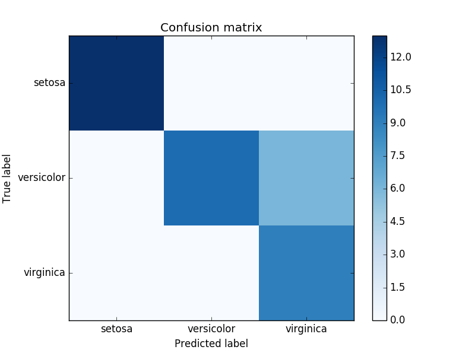

#scikit-learn model evaluation

**Note: this project is in a very early stage of development.**

scikit-learn model evaluation is a package to make model evaluation much easier.

#Usage

The package is divided in modules that have specific functionality.

##Plots module

Generate evaluation plots with a single function call.
```python
from sklearn_model_eval import plots

#code for data loading and model training

plots.confusion_matrix_(y_true, y_pred, target_names=target_names)
```



See this Jupyter [notebook](examples/plots.ipynb) for more examples.

##Tables module

Generate good looking tables from your model easily.

```python
from sklearn_model_eval import tables

#for for data loading and training

tables.feature_importances(model, feature_list)
```

```
+-----------+--------------+-----------+
| name      |   importance |       std |
+===========+==============+===========+
| Feature 0 |    0.250398  | 0.0530907 |
+-----------+--------------+-----------+
| Feature 1 |    0.232397  | 0.0523836 |
+-----------+--------------+-----------+
| Feature 2 |    0.148898  | 0.0331814 |
+-----------+--------------+-----------+
| Feature 3 |    0.0553634 | 0.0128296 |
+-----------+--------------+-----------+
| Feature 8 |    0.05401   | 0.0122248 |
+-----------+--------------+-----------+
| Feature 5 |    0.053878  | 0.01289   |
+-----------+--------------+-----------+
| Feature 6 |    0.0525828 | 0.0130225 |
+-----------+--------------+-----------+
| Feature 9 |    0.0510197 | 0.0129436 |
+-----------+--------------+-----------+
| Feature 7 |    0.0509633 | 0.0117197 |
+-----------+--------------+-----------+
| Feature 4 |    0.0504887 | 0.012844  |
+-----------+--------------+-----------+
```

Also, running this in Jupyter will generate a pandas-like output. See [notebook](examples/plots.ipynb)

##Report generation module

Generate HTML reports in one line.

```python
from sklearn_model_eval.report import ReportGenerator

#code for data loading and model training

#Instantiate ReportGenerator with a path to save the HTML files
rg = ReportGenerator(savepath='~/my-awesome-models')
#Generate report
rg.generate_report(model=forest, y_true=y_true, y_pred=y_pred, y_score=y_score, feature_list=feature_list, target_names=target_names, name=name)
```

The code above will generate a report [like this.](http://htmlpreview.github.com/?https://github.com/edublancas/sklearn-model-evaluation/blob/master/examples/sample_report.html)

Reports are self-contained, all images are included in the html file using [base64](https://en.wikipedia.org/wiki/Base64).

#Install

Note: cloning takes a bit since baseline images and trained models are needed for testing. I'll fix it soon.

```shell
git clone https://github.com/edublancas/sklearn-model-evaluation
cd sklearn-model-evaluation
python setup.py install
```

#Design caveats

* Precision-Recall and ROC curve use `label_binarize` each time they are used.

#TODO

* Print lists-like objects as nice html tables in reports
* Include more plots (learning plot, for example)
* plots.confusion_matrix_ should be plots.confusion_matrix