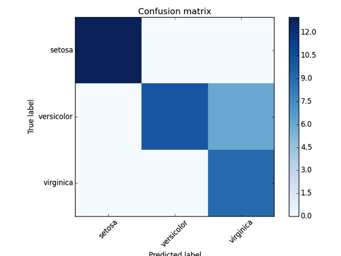

# sklearn-evaluation


[](https://sklearn-evaluation.readthedocs.io/en/latest/?badge=latest)
[](https://badge.fury.io/py/sklearn-evaluation)
[](https://coveralls.io/github/edublancas/sklearn-evaluation)
[](https://twitter.com/intent/user?screen_name=ploomber)
[](https://github.com/psf/black)


<p align="center">
  <a href="https://ploomber.io/community">Join our community</a>
  |
  <a href="https://www.getrevue.co/profile/ploomber">Newsletter</a>
  |
  <a href="mailto:contact@ploomber.io">Contact us</a>
  |
  <a href="https://docs.ploomber.io/">Docs</a>
  |
  <a href="https://ploomber.io/">Blog</a>
  |
  <a href="https://www.ploomber.io">Website</a>
  |
  <a href="https://www.youtube.com/channel/UCaIS5BMlmeNQE4-Gn0xTDXQ">YouTube</a>
</p>

Machine learning model evaluation made easy: plots, tables, HTML reports, experiment tracking, and Jupyter notebook analysis.

Supports Python 3.7 and higher. Tested on Linux, macOS and Windows.

*Note:* Recent versions likely work on Python 3.6, however, `0.8.2` was the latest version we tested with Python 3.6.

[Documentation here.](https://sklearn-evaluation.readthedocs.io)



# Install  

```bash
pip install sklearn-evaluation
```

# Features

* [Plotting](https://sklearn-evaluation.ploomber.io/en/latest/classification/basic.html) (confusion matrix, feature importances, precision-recall, roc, elbow curve, silhouette plot)
* Report generation ([example](https://htmlpreview.github.io/?https://github.com/ploomber/sklearn-evaluation/blob/master/examples/report.html))
* [Evaluate grid search results](https://sklearn-evaluation.ploomber.io/en/latest/optimization/grid_search.html)
* [Track experiments using a local SQLite database](https://sklearn-evaluation.ploomber.io/en/latest/comparison/SQLiteTracker.html)
* [Analyze notebooks output](https://sklearn-evaluation.ploomber.io/en/latest/comparison/NotebookCollection.html)
* [Query notebooks with SQL](https://sklearn-evaluation.ploomber.io/en/latest/comparison/nbdb.html)

